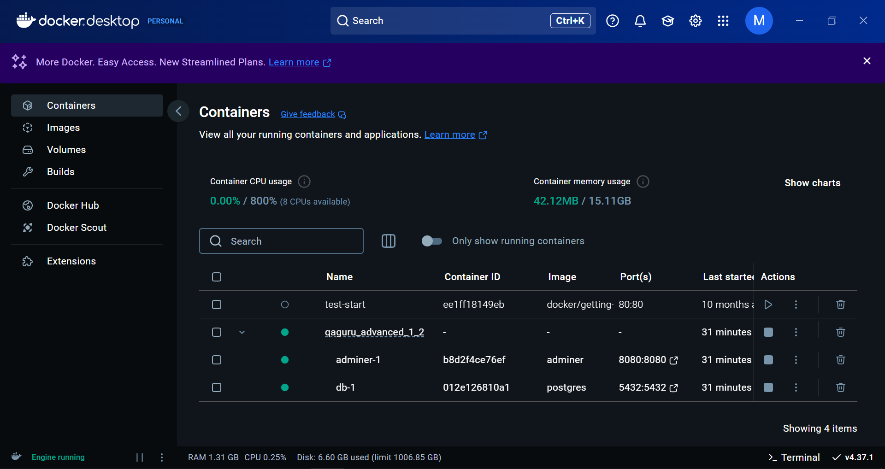

## Построение минимального микросервиса с FastApi и тесты  
Применяемые механики:  
- загрузка файла `users.json` в память сервера
- валидация данных файла при запуске сервера `uvicorn`
- обработка исключений с помощью `HTTPException`
- обработка разных типов исключений с помощью `HTTPException`
- вынос чувствительных данных в файл `.env`
- параметризация тестов `@pytest.mark.parametrize()`  
- тестирование доступности сервера через модель `AppStatus` - установка простого флага, что база существует
- Использование библиотеки `fastapi-pagination` для базовой пагинации в эндпоинтах  
[fastapi-pagination](https://github.com/uriyyo/fastapi-pagination)  


### Задание:  
1. Расширить тестовое покрытие smoke тестами на доступность микросервиса.
2. Добавить сервисный эндпоинт /status для проверки доступности микросервиса.
3. Использовать библиотеку fastapi-pagination для базовой пагинации в эндпоинтах, которые возвращают список объектов.
4. Добавить тесты на пагинацию. Тестовых данных должно быть достаточно для проверки пагинации (не менее 10).
5. Проверяем:
    - ожидаемое количество объектов в ответе;
    - правильное количество страниц при разных значениях size;
    - возвращаются разные данные при разных значениях page;

## Доработаем микросервис - добавим базу данных  
1. Добавим реализацию базы данных (docker + postgres)
2. Обновим тесты  
Новые библиотеки в проекте:  
- `psycopg2-binary` - драйвер для работы с базой данных postgres  
- `sqlalchemy` 
- `sqlmodel` - позволяет использовать стандартные модели pydantic для описания моделей из базы данных

3. Получим с `docker hub` необходимый конфигурационный файл  `docker-compose.yml` и поместим в проект  
[docker hub](https://hub.docker.com/_/postgres)
4. Запустить Docker локально 
```
C:\Program Files\Docker\Docker\Docker Desktop.exe
```
  
5. Запуск командой `docker compose up -d` можно перейти по адресу порта `http://localhost:8080/` 
и убедится что админка из файла `docker-compose.yml` активна  

Можем войти используя имя/пароль из docker файла:
```
Use postgres/example user/password credentials
```
  
