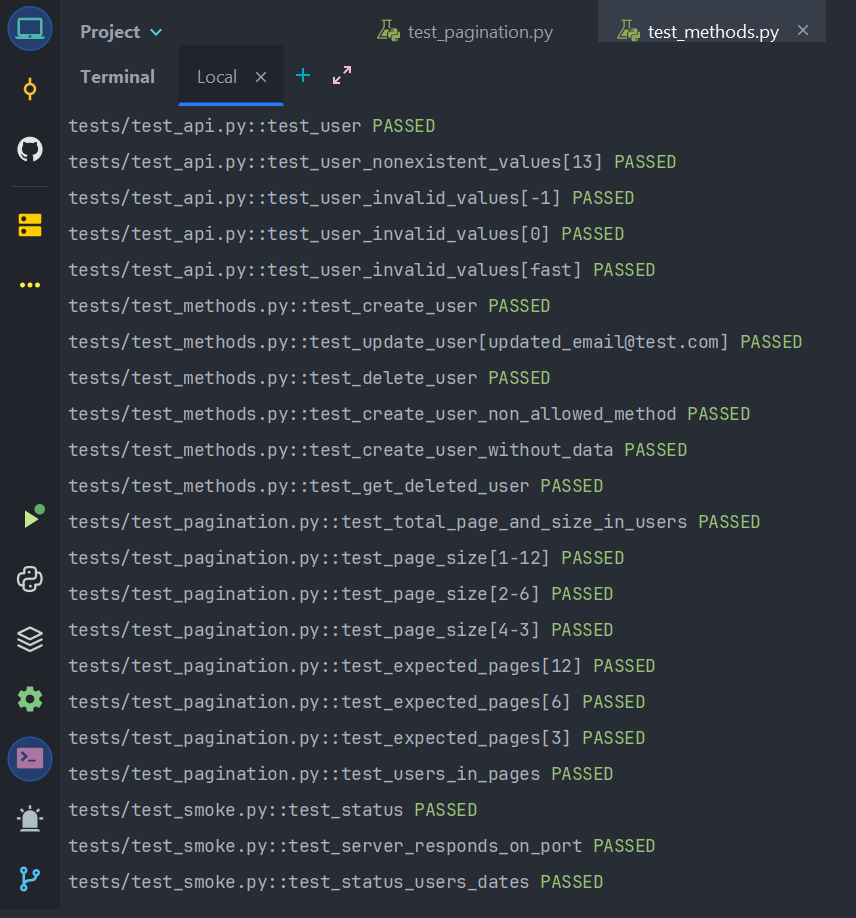

## Построение минимального микросервиса с FastApi и тесты. Добавляем базу данных

[Wikipedia](https://github.com/MDN78/qaguru_advanced_1_2/wiki/Add-database)

### Задание:

1. Запустить postgresql в докере.
   Запустить проект локально (в докере будем запускать в следующем занятии).
2. Расширить тестовое покрытие:
- Тест на post: создание. Предусловия: подготовленные тестовые данные (сгенерированные фэйковые данные)
- Тест на delete: удаление. Предусловия: созданный пользователь
- Тест на patch: изменение. Предусловия: созданный пользователь

По желанию:

- Get после создания, изменения
- Тест на 405 ошибку: Предусловия: ничего не нужно
- 404 422 ошибки на delete patch
- 404 на удаленного пользователя
- user flow: создаем, читаем, обновляем, удаляем
- валидность тестовых данных (емейл, урл)
- отправить модель без поля на создание

### Реализация

1. Запуск posgresql in Docker

Docker

 

    

Swagger

 

    

2. Запустить проект локально

Local run

 

  

3. Реализованы тесты:

- [x] Тест на post: создание
- [x] Тест на delete: удаление
- [x] Тест на patch: изменение
- [x] Тест на 405 ошибку - неподдерживаемый метод
- [x] Тест на 422 ошибку - отправить модель без поля на создание
- [x] Тест 404 на удаленного пользователя